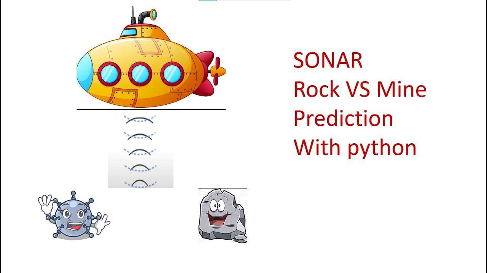

# SONAR Rock vs Mine Prediction

A machine learning project that predicts whether an underwater object is a rock or a mine based on SONAR data.

## 📌 Overview

This project uses the SONAR dataset to build a binary classification model that can distinguish between rocks and mines. Submarines use SONAR (Sound Navigation and Ranging) signals to detect objects underwater. The signals bounced back from different materials have unique patterns, which can be used to identify the object.

## 🗂️ Dataset

The dataset contains 208 samples with 60 features each:

- Each feature represents the energy within a particular frequency band
- Labels: 'R' for Rock and 'M' for Mine
- 111 rock samples and 97 mine samples

## 🧠 Model

The classification is implemented using **Logistic Regression** which performed well on this dataset with:

- Training accuracy: ~85%
- Test accuracy: ~80%

## 📊 Methodology

1. **Data Preprocessing**

   - Loading and exploring the dataset
   - Splitting into features (X) and target (Y)
   - Train-test split with stratified sampling

2. **Model Training**

   - Training the Logistic Regression model
   - Evaluating performance on training and test sets

3. **Prediction System**
   - Building a prediction system for new SONAR data inputs
   - Converting input data to appropriate format
   - Making predictions based on the trained model

## 🚀 Results

The model successfully classifies underwater objects as rocks or mines based on their SONAR signatures with good accuracy, demonstrating the potential of machine learning for underwater object detection.

## 🛠️ Technologies Used

- Python
- NumPy
- Pandas
- scikit-learn
- Logistic Regression

## 🔍 Future Improvements

- Experiment with other classification algorithms
- Hyperparameter tuning for better performance
- Feature engineering to improve accuracy
- Implement cross-validation for more robust evaluation

---

_Note: This project is for educational purposes only and demonstrates the application of machine learning in underwater object classification._
